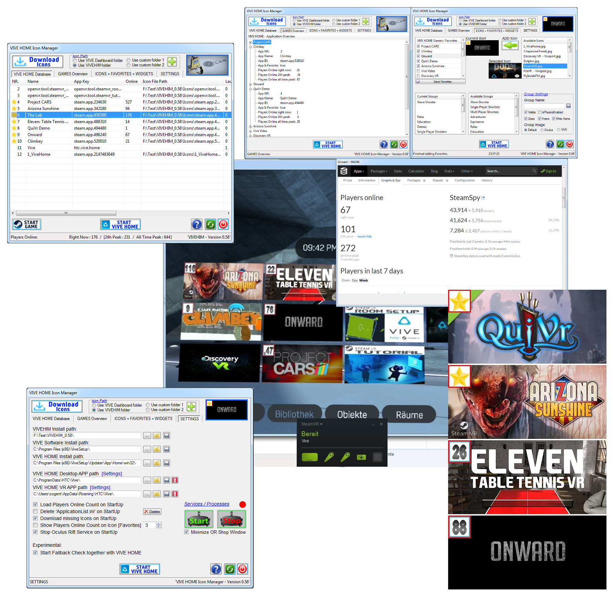

# VIVEHIM
VIVE HOME Icon Manager

# Features:

1. Download and add missing SteamVR game icons to VIVE HOME database
2. Change the path for the icons, there are four to choose from, two of them can be user defined
3. Add icons to selected games (for example, non Steam games)
4. Add groups that can be used in VIVE HOME to organize the shortcuts
5. Selection and creation of favorites (with online player count)
6. Add number of players (online Player count) to the icons (Favorites) see pictures
7. Start VIVE HOME directly from VIVEHIM (player number count on icons can be updated automatically if selected in settings)
8. Steam Games Info GUI if selecting Sub Item of a game in Games Overview TAB
9. Automatic download of missing Icons on Start Up. (Only if File does not exist. For the originals/new ones use Download Icons Button)
10. Start Games by double click in "VIVE HOME Database" TAB or using the Button
11. Fallback to VIVE HOME after game was closed

# Pictures:

[TAB 1](http://www.cogent.myds.me/Bilder_Videos/VIVEHIM/TAB_1.jpg)

[TAB 2](http://www.cogent.myds.me/Bilder_Videos/VIVEHIM/TAB_2.jpg)

[TAB 3](http://www.cogent.myds.me/Bilder_Videos/VIVEHIM/TAB_3.jpg)

[TAB 4](http://www.cogent.myds.me/Bilder_Videos/VIVEHIM/TAB_4.jpg)

[VIVE HOME](http://www.cogent.myds.me/Bilder_Videos/VIVEHIM/VIVEHOME.jpg)

[ICONS](http://www.cogent.myds.me/Bilder_Videos/VIVEHIM/Icons.jpg)

# Download:
[Download compiled](http://evo-x.de/wbb3/board453-community-magazin/board595-virtual-reality-vr/220052-vivehim-vive-home-icon-manager-download-and-fixes-missing-icons-in-vive-home/)

# Installation:

1. Download latest compiled version of [VIVEHIM](http://evo-x.de/wbb3/board453-community-magazin/board595-virtual-reality-vr/220052-vivehim-vive-home-icon-manager-download-and-fixes-missing-icons-in-vive-home/) or Download/use the latest source (needs [Autoit](https://www.google.de/url?sa=t&rct=j&q=&esrc=s&source=web&cd=1&cad=rja&uact=8&ved=0ahUKEwjor9ffsu_SAhUDApoKHa6oCuoQFggcMAA&url=https%3A%2F%2Fwww.autoitscript.com%2Fsite%2Fautoit%2F&usg=AFQjCNECxpQwBMyWTBgGsfZwK4g_k-1Ogg&sig2=XWhxvkh8Tx9EZUh1S6BQfw))
2. Unzip/Install VIVEHIM in your preferred directory
3. Start VIVEHIM using the File 'StartVIVEHIM.exe' in choosen VIVEHIM folder
3. If VIVEHIM was fresh installed or used for the first time then it will take some time for loading

*If you did not use the default install folders for VIVEHOME and VIVEHIM does not found the needed folder then a pop up Window will appear asking for the needed install folders.

